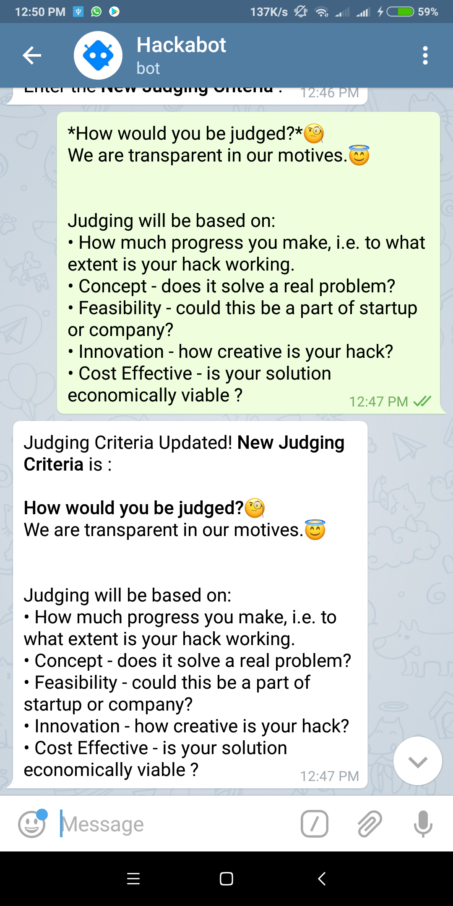

# HackaBot

  &nbsp;&nbsp;
  &nbsp;&nbsp;

**HACKABOT** is a [**telegram bot**](https://telegram.org/blog/bot-revolution) for Hackathon participants and organisers. It is developed in [NodeJS](https://nodejs.org/en/) is live on Telegram as [@The_Hackathon_Bot](https://web.telegram.org/#/im?p=@The_Hackathon_Bot). It answers to the common questions of participants during and before a Hackathon and help organisers in keeping participants/applicants updated with the latest news. It also allows the participants and organisers to share pictures with each other during the event and much more... And the best part is that all of it automated without requesting any effort from the organisers.

Developed by [Ankush Garg](https://ankushgarg1998.github.io/) & [Ekta Sangwan](http://github.com/ektasangwan).

## Winner of [The Hacksociety](https://www.hacksociety.tech/)'s [Telegram Bot Challenge](https://www.hacksociety.tech/attend/challenge/telegram-bot).

<figure class="video_container">
  <iframe width="853" height="480" src="https://www.youtube.com/embed/5wchrayd0-Y" frameborder="0" allow="accelerometer; autoplay; encrypted-media; gyroscope; picture-in-picture" allowfullscreen></iframe>
</figure>

## FEATURES

### 1. Common questions of the applicants

&nbsp;&nbsp;&nbsp;&nbsp;
&nbsp;&nbsp;&nbsp;&nbsp;

Most Commonly, applicants redundantly ask question about details, schedule, location, itinerary, judging criteria etc. All these questions can be answered by the bot, saving organisers a load of time. HACKABOT provides the organisers with the liberty to update the details, schedule, judging criteria and location anytime (and make an announcement to notify all subscribers).

&nbsp;&nbsp;&nbsp;&nbsp;
&nbsp;&nbsp;&nbsp;&nbsp;

### 2. Poster with the details

&nbsp;&nbsp;&nbsp;&nbsp;

Organisers can add a Poster to be sent with the details, update it or remove it anytime.

### 3. Subscribe/Unsubscribe to the updates

&nbsp;&nbsp;&nbsp;&nbsp;
&nbsp;&nbsp;&nbsp;&nbsp;

Though the bot for a Hackathon will be open to all, but any interested user can */subscribe* to the updates. All the Subscribers will receive every broadcasted message/image or announcement made by organisers. As soon as any user subscribes or unsubscribes the organiser account is instantly notified.

### 4. Announcement and Broadcasting for Organisers

&nbsp;&nbsp;&nbsp;&nbsp;

The organiser can either make a text announcement using */announcement* or broadcast an image using */broadcastPic* that will be sent to all the subscribers instantly.

### 5. Share a picture
Participants click a lot of picture during the hack. HACKABOT provides participants with the ability to share these pics with the organisers using command */sharepic*.

### 7. Feedbacks
Participants can send feedbacks using command */feedback* about the hackathon to the organisers. Organiser account is instantly notified when a user fills a feedback. The organiser can also read all the feedbacks later.

### 7. All Announcements, All Feedbacks, All Subscribers

&nbsp;&nbsp;&nbsp;&nbsp;
&nbsp;&nbsp;&nbsp;&nbsp;

- */allannouncements* is for participants that show all announcements in case he missed any.
- */allFeedbacks* is for the organisers to see all feedbacks together.
- */allSubscribers* is for organisers to retrieve a list of the Subscribers.

### 7. HELP
*/help* command can be used by anyone seeking help about the bot or commands.

## All Commands Documentation
You can control HACKABOT by sending these commands:

- **/help** - Gets this message anytime, if you're stuck.

### Participant Commands
- **/details** - Shows Details of the Hackathon
- **/judgingcriteria** - Shows Judging Criteria
- **/schedule** - Shows Schedule of the Hack
- **/location** - Venue of the Event
- **/subscribe** - Subscribe to updates of this Hackathon
- **/unsubscribe** - Unsubscribe from updates of this Hackathon
- **/allannouncements** - Shows the List of all the announcements happened yet
- **/sharepic** - You can share your click with the organisers
- **/feedback** - You can send feedback to the organisers of the Hack

But wait, you don't actually have to type these commands. See that *[/]* (slash box) at the bottom-right. Just press that and you can select any command.

### Commands for Organisers
*(You have to be an organiser to be able to use these)*

- **/editDetails** - Edit the Details Message
- **/editCriteria** - Edit the Judging Criteria
- **/editSchedule** - Edit the Schedule Message
- **/newPoster** - Add/Update a poster to your hackathon. This poster is shared with the Details to the participants.
- **/removePoster** - No Poster will be shared.
- **/editLocation** - Edit the Venue(Longitudes, Latitudes) of the Hack
- **/allSubscribers** - View a list of all the subscribers
- **/announcement** - You can make an announcement that'll be pushed to all subscribers as a message instantly
- **/broadcastPic** - Broadcast a pic to all the subscribers
- **/allFeedbacks** - Fetches all the feedbacks received yet.

HAPPY HACKING!

## Upcoming Features
- Support for Multiple Organiser Accounts
- Buttons for Organising accounts.
- Feature to see other upcoming Hackathons, by date or by nearby (uses user location).
- Applying to the Hackathon through the bot itself.

## CONTRIBUTE
- Raise an issue and tell us you're working on it. Or work on an existing issue.
- Fork the repository
- Commit your code
- Create a Pull Request

[MIT Licence](https://github.com/ankushgarg1998/telegram-bot/blob/master/LICENSE) © [Ankush Garg](https://ankushgarg1998.github.io/)
